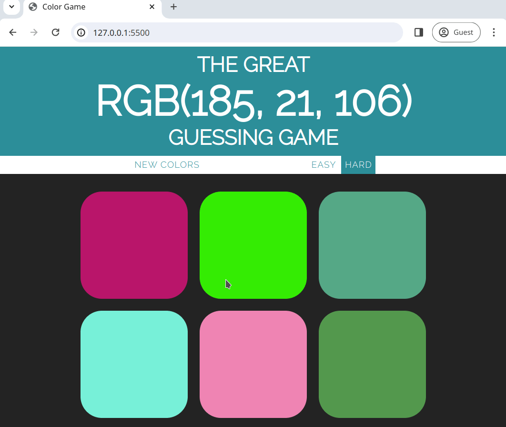

# 🎨 Color Guessing Game 🎨

This is a simple, interactive color-guessing game built with HTML, CSS, and JavaScript. The objective is to guess the correct RGB color displayed at the top of the page by selecting one of the colored squares. The game includes two difficulty modes: Easy and Hard.

 - [GitHub Pages to try this game](https://sandoropiok.github.io/color-guessing-game/)

## 👀 Project Overview

The Color Guessing Game generates random colors for a grid of squares and challenges the player to pick the correct color based on an RGB value displayed at the top. When the player guesses correctly, the page color changes to indicate success. This project helps reinforce fundamental web development skills, including DOM manipulation, event handling, and basic game logic.

## 💻 Features

- **Random Color Generation:** Each game round generates a new set of colors for the squares, including one "correct" color to guess.
- **Two Difficulty Levels:** Easy mode displays three squares, while Hard mode displays six squares.
- **Interactive Feedback:** Players receive visual and textual feedback when they guess correctly or incorrectly.
- **Reset Functionality:** Players can reset the game to get new colors without reloading the page.

## 🚀 How to Play

1. The RGB value of the target color is displayed at the top of the page.
2. Choose a difficulty level by selecting either the "Easy" or "Hard" button:
   - **Easy:** Only 3 squares are displayed.
   - **Hard:** All 6 squares are displayed.
3. Click on one of the colored squares to guess the color.
   - If correct, all squares change to the target color, the message "CORRECT!" appears, and the page header changes to the correct color.
   - If incorrect, the square clicked disappears, and the message "TRY AGAIN" appears.
4. Click "New Colors" to start a new game with different colors.

## 👾 Gameplay gif

- short gif to show how it works and how to play



## Project Structure

The project consists of three main files:

- `index.html`: The HTML structure for the game.
- `style.css`: The styling of the game, including color, layout, and transitions.
- `script.js`: The JavaScript logic that manages color generation, user interaction, and game state.

## 🛠️ Installation

To run this project locally, follow these steps:

1. Clone or download this repository to your local machine.
```bash
git clone git@github.com:sandoropiok/color-guessing-game.git
```
2. Open the project folder and double-click `index.html` to launch the game in your web browser.
```bash
cd color-guessing-game
```
Alternatively, you can host the project on a web server or use services like GitHub Pages to make it available online.

